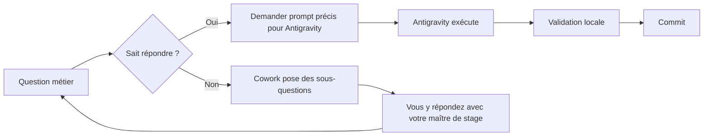

# 🤝 Guide de travail : Cowork + Antigravity pour GRANTFLOW IPD

> Comment développer GRANTFLOW IPD en binôme avec deux assistants IA complémentaires : **Claude Cowork** (planification & guidage) et **Google Antigravity** (écriture du code dans l'IDE).

---

## 1. Pourquoi deux outils ?

Les deux assistants ne font pas le même métier.

| Cowork (Claude) | Antigravity (Google) |
|---|---|
| **Conversation longue** — garde le contexte sur des jours | **IDE agentique** — comprend votre code source |
| Sert à **réfléchir, planifier, expliquer** | Sert à **écrire, modifier, exécuter** des fichiers |
| Excellent en analyse métier (SYSCEBNL, conventions bailleurs) | Excellent en génération de code structuré |
| Produit des **livrables documentaires** (mémoire, schémas) | Produit des **commits** dans votre repo |
| Vous pouvez lui partager des écrans, des PDF, des données | Il voit votre arborescence et exécute des commandes |

**En résumé :** Cowork vous aide à **savoir quoi faire**, Antigravity vous aide à **le faire**.

---

## 2. Méthode "Sprint Cowork × Antigravity"

Pour chaque sprint de 2 semaines, suivez ce rituel :

### Étape 1 — Cadrage avec Cowork (1 h)

Démarrez une session Cowork avec un message du type :

```
Bonjour Claude. Je démarre le Sprint 2 de GRANTFLOW IPD (module Demandes d'achat).
Le contexte projet est dans le fichier CLAUDE.md du repo.

Aide-moi à :
1. Faire le bilan du Sprint 1
2. Découper les user stories du Sprint 2 en tâches techniques
3. Lister les risques et points d'attention
4. Produire la liste précise des prompts à donner à Antigravity
```

À la fin de cette étape, vous repartez avec :
- Une **fiche de sprint** (Markdown) à coller dans `docs/sprints/sprint-NN.md`
- Une **liste de prompts** prêts à coller dans Antigravity (à ajouter à `ANTIGRAVITY_PROMPTS.md`)

### Étape 2 — Exécution avec Antigravity (5 à 8 jours)

Pour chaque tâche technique :

1. Ouvrez **Antigravity** et chargez le dossier `grantflow-ipd/` à la racine.
2. Vérifiez que `CLAUDE.md` est ouvert dans un onglet (Antigravity le lira automatiquement comme contexte).
3. Collez le prompt préparé en étape 1.
4. **Relisez attentivement** ce que l'agent propose avant d'accepter — surtout :
   - Logique métier (calcul d'overhead, équilibre comptable…)
   - Sécurité (validation, RBAC, secrets)
   - Tests (présents et significatifs)
5. Acceptez, puis lancez la suite locale :
   ```bash
   npm run lint
   npm run typecheck
   npm run test
   ```
6. Si tout passe → commit avec un message conventionnel :
   ```bash
   git commit -m "feat(procurement): add PR creation endpoint with budget check"
   ```

### Étape 3 — Revue et déblocage avec Cowork (30 min en cours de sprint)

Quand Antigravity bloque ou propose une solution douteuse, revenez voir Cowork :

```
Cowork, Antigravity me propose le code suivant pour le rapprochement 3 voies :

[paste code]

Mais je vois que les écarts de change ne sont pas pris en compte. Comment
gérer proprement le cas d'une facture en USD rapprochée d'un BC en EUR ?
```

Cowork peut **piloter à l'envers** : raisonner sur la logique, vous donner
un patch précis à appliquer dans Antigravity.

### Étape 4 — Démo et retour d'expérience (1 h, fin de sprint)

À la fin du sprint, partagez les écrans/diff avec Cowork :

```
Cowork, voici le résumé du sprint 2 : [coller la liste des commits + screenshots].
Aide-moi à :
1. Rédiger la fiche de démo (3 slides)
2. Identifier les améliorations à prévoir
3. Mettre à jour CLAUDE.md s'il y a de nouvelles règles métier
```

---

## 3. Bonnes pratiques de prompts

### ✅ Prompts efficaces

```
[Antigravity] Crée le service PurchaseRequestService dans
apps/api/src/procurement/. Il doit :
- exposer create(userId, dto) qui vérifie le budget disponible
- exposer submit(prId, userId) qui passe en PENDING_PI
- utiliser une transaction Prisma pour la création
- générer un numéro DA-YYYY-NNNN
- créer un événement audit log à chaque opération
- inclure des tests Jest avec mock Prisma
```

### ❌ Prompts à éviter

```
[Antigravity] Fais-moi la gestion des achats.
```

Trop vague → l'agent va inventer des hypothèses, parfois fausses. Le projet
risque l'incohérence.

### 🧠 Astuce : prompts "Chain of Thought"

Pour les sujets délicats (comptabilité, fonds dédiés), commencez par :

```
[Antigravity] Avant d'écrire le code, explique-moi en 5 lignes comment tu
comptes implémenter le calcul des fonds dédiés selon SYSCEBNL. Si tu n'es
pas sûr, demande-moi de clarifier.
```

L'agent va d'abord raisonner, ce qui réduit drastiquement les erreurs métier.

---

## 4. Workflow Git recommandé

```text
main             ───────────●─────────────●─────────●────────  (production)
                            │ merge sprint 1     merge sprint 2
sprint-1                  ──●─●─●─●  (feat: M1, M2, M3)
sprint-2                              ──●─●─●─●  (feat: M5, M7)
hotfix/*                                              ─●─
```

- 1 branche par sprint
- 1 commit par feature/correction (messages [conventional commits](https://www.conventionalcommits.org/))
- Pull Request avec revue (auto-revue + relecture Cowork)
- Merge en `main` uniquement si tous les tests passent

---

## 5. Cycle "Cowork-first" en cas de doute

Quand vous avez un doute métier, **toujours** commencer par Cowork :



---

## 6. Fichiers à toujours garder ouverts

Dans Antigravity, ayez ces fichiers en onglet visible pour que l'agent les considère :

1. `CLAUDE.md` — contexte projet (règles d'or)
2. `apps/api/prisma/schema.prisma` — modèle de données
3. `packages/shared/src/index.ts` — types partagés
4. Le fichier en cours d'édition

---

## 7. Quand parler à Cowork plutôt qu'à Antigravity ?

| Situation | Bon outil |
|---|---|
| Comprendre un concept SYSCEBNL | **Cowork** |
| Concevoir une architecture | **Cowork** |
| Mettre à jour un schéma Prisma | **Antigravity** |
| Écrire un endpoint REST | **Antigravity** |
| Rédiger une partie du mémoire | **Cowork** |
| Préparer une démo client | **Cowork** |
| Refactorer du code | **Antigravity** |
| Débugger une erreur Prisma | **Antigravity** (en lecture du code) |
| Comprendre une exigence floue du DAF | **Cowork** (vous pouvez lui partager des notes) |
| Préparer un rapport bailleur | **Cowork** |

---

## 8. Garde-fous

Quelle que soit la qualité des IA, n'oubliez pas :

- 🔒 **Aucune donnée réelle de l'IPD ne doit être envoyée aux IA cloud** sans accord (anonymiser les exemples).
- 🧠 **Le code généré doit être compris.** Si vous ne savez pas expliquer une ligne, demandez-vous (ou demandez à Cowork) ce qu'elle fait.
- ✅ **Les tests sont votre filet de sécurité.** Pas de merge sans tests.
- 📚 **Le code doit aussi servir le mémoire.** Commentez les décisions de conception : ces commentaires alimenteront votre rapport.
- 👨‍🏫 **Soumettez les choix structurants à votre encadrant pédagogique** (architecture, choix techno, périmètre).

---

_Mis à jour : 14/05/2026 — El Hadj Amadou NIANG_
